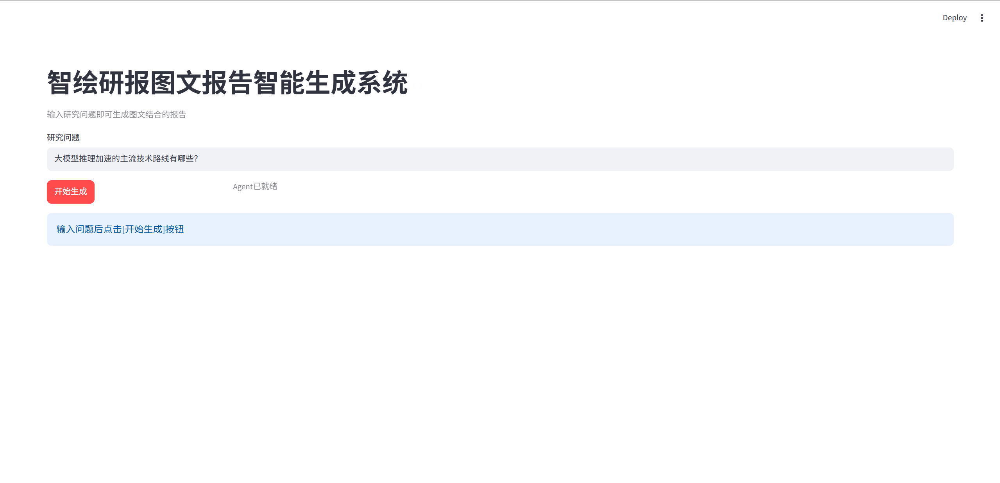
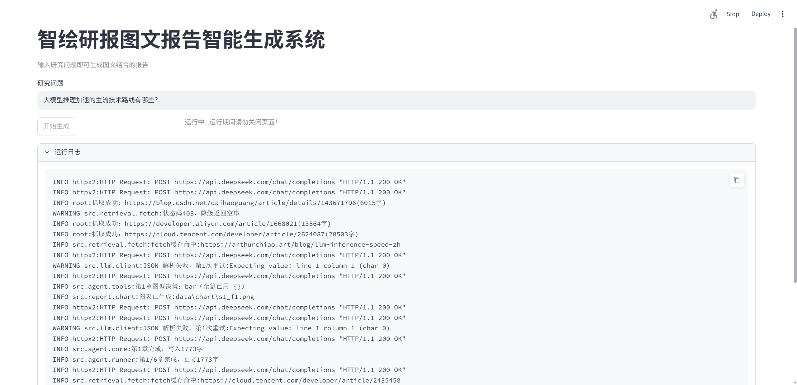
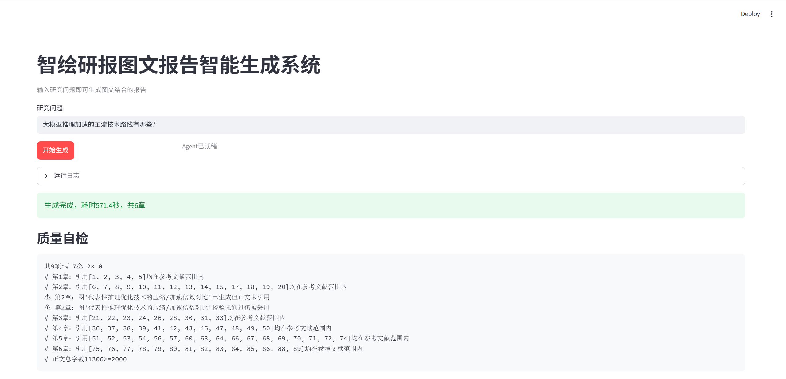
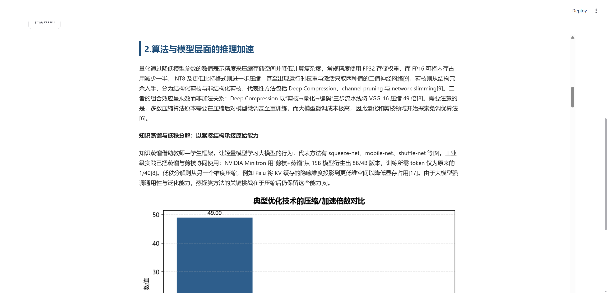

# 智绘研报图文报告智能生成系统 V1.0

> DeepResearch 式长图文报告生成 Agent：输入一个研究问题，系统自动完成规划、多源联网检索、证据整理、分章撰写、图表生成与校验、报告合成，最终输出一份带图表与引用来源的图文研究报告（Markdown / HTML）。


---

## 项目简介

本系统面向需要快速获得「有来源、有图表」调研报告的使用者。它不依赖 LangChain 等 Agent 框架，而是自行实现了一个最小可用的 Agent 内核。由大模型负责规划与写作决策，由程序负责检索、绘图、校验与装配，二者通过一套 JSON 动作协议协作。

规划式提纲、多源证据检索、图表生成管线、图文一致性校验与报告质量自检。

## 效果预览

| 主界面 | 运行进度 |
|---|---|
|  |  |

| 报告质量自检 | 图文报告预览（HTML） |
|---|---|
|  |  |

## 主要特性

| 能力 | 说明 |
|---|---|
| 手写 Agent 内核 | 不依赖 LangChain/LangGraph，自行实现「规划 + JSON 动作循环」，含步数上限、未知动作回灌纠错、工具异常隔离、章节级熔断与保底成稿 |
| 多源检索 | 网页检索（Tavily / DuckDuckGo）与学术检索（OpenAlex，DOI 优先、按被引量排序）并行，检索器可插拔 |
| 三级抓取降级链 | trafilatura → BeautifulSoup → 搜索摘要，任何网络异常都不会中断整个流程 |
| 双层缓存 | 检索结果缓存与网页正文缓存，重复运行近乎零成本，同时节省 API 额度 |
| 图表生成管线 | 从证据提取数值 → 绘图 → 图文一致性校验。图型由代码按数据形态决策（占比→环形图、趋势→折线、并列对比→柱状/条形），配色随图序变化 |
| 报告自检器 | 合成后自动体检，包括引用完整性、引用越界（防幻觉）、图表一致性、章节结构、字数达标，输出检查结果清单 |
| 插件化扩展 | `src/providers/` 目录自动检测新增检索器、模型渠道。校验器只需复制模板并实现一个方法 |
| 双渠道模型 | 同一套 OpenAI 兼容适配层，本地（Ollama / LM Studio）与在线 API（DeepSeek 等）通过配置切换 |
| Web 界面 | 输入问题、实时进度日志、Markdown/HTML 报告预览与一键下载 |
| 回归样例集 | `examples/questions.json` 固定问题集 + `scripts/regression.py`，记录章节数、字数、自检结果与耗时，便于量化对比改动效果 |

## 系统架构

| 层次 | 模块 | 职责 |
|---|---|---|
| UI 层 | `src/ui/app.py` | 问题输入、配置、进度展示、报告预览与下载 |
| 应用层 | `src/agent/runner.py` | 端到端流水线，CLI 与 GUI 共用同一执行体 |
| | `src/agent/core.py` | 手写 Agent 内核：JSON 动作循环、工具调度、异常与熔断处理 |
| | `src/agent/planner.py` | 研究问题 → 3~6 章提纲（含中英文检索关键词） |
| 能力层 | `src/retrieval/` | 检索器、网页抓取降级链、检索与正文双层缓存 |
| | `src/report/` | 图表生成管线、TextVerifier、报告合成、HTML 渲染、质量自检器 |
| 基础设施 | `src/llm/` | OpenAI 兼容统一客户端（重试与退避、JSON 容错解析） |
| | `src/providers/` | 插件注册与自动发现（检索器 / 模型 / 校验器） |

**一次运行的数据流**：

```
研究问题
  → 规划提纲（Planner）
  → 逐章执行动作循环：search（多源检索+抓取+入库）→ draw_chart → write_section
  → 自动配图补全 → 引用全局重排（统一编号 + 文末参考文献）
  → 报告合成（Markdown）→ HTML 渲染（图片 base64 内嵌，单文件自包含）
  → 质量自检（引用/图表/结构/字数）
```

## 目录结构

```
deepresearch-report-agent/
├── config.yaml                # 主配置：模型渠道、检索器、图表、报告参数
├── requirements.txt
├── pyproject.toml             # 可编辑安装（pip install -e .）
├── src/
│   ├── agent/                 # core(动作循环) / planner / tools / state / runner
│   ├── llm/                   # OpenAI 兼容客户端（chat / chat_json）
│   ├── providers/             # 插件目录：tavily / ddgs / openalex / arxiv / openai_compatible
│   ├── report/                # chart / verify / auto_chart / synthesizer / render / checker
│   ├── retrieval/             # search / fetch(降级链) / cache(两级缓存)
│   ├── ui/                    # Streamlit 界面
│   └── utils/                 # 配置加载与项目根定位
├── scripts/                   # CLI 入口、冒烟测试、回归脚本
├── examples/                  # 回归问题集（questions.json）与历史产物
└── docs/                      # PRD / 架构说明 / 排期 / 界面截图
```

## 快速开始

```bash
# 1) 创建环境（conda 或 venv 均可）
conda create -n zhyb python=3.11 -y
conda activate zhyb
pip install -r requirements.txt

# 2) 配置密钥（复制模板后填写）
cp .env.example .env          # 至少填写 TAVILY_API_KEY，使用在线模型时再填对应 KEY

# 3) 可选：准备本地模型
ollama pull qwen3:8b

# 4) 启动 Web 界面
streamlit run src/ui/app.py   # 浏览器访问 http://localhost:8501
```

命令行方式（便于脚本化与批量运行）：

```bash
python scripts/m2_report.py "大模型推理加速的主流技术路线有哪些？"
# 产物：data/outputs/report_<hash>.md 与同名 .html（图片 base64 内嵌，单文件可分享）

python scripts/regression.py --limit 1     # 运行回归样例集并记录统计
```

## 配置说明

`config.yaml` 主要配置项：

| 配置项 | 说明 |
|---|---|
| `llm.provider` | 固定为 `openai_compatible`；具体渠道由 `base_url` / `model` / `api_key_env` 决定 |
| `llm.timeout` | 建议 180（本地模型处理长上下文较慢） |
| `search.provider` | `tavily`（默认）或 `ddgs`（免费兜底） |
| `search.extra_providers` | `["openalex"]` 启用学术检索；设为 `[]` 关闭 |
| `chart.verify_mode` | `text`（默认，任意模型可用的图文一致性校验） |
| `report.min_words` | 报告正文字数下限，供自检器使用 |

切换模型渠道（改三行即可，以下是例子）：
```yaml
# 本地 Ollama：开发调试使用，免费且不消耗额度
llm:
  base_url: http://localhost:11434/v1
  model: qwen3:8b
  api_key_env: ""

# 在线 DeepSeek：正式生成使用，长文输出更稳定
llm:
  base_url: https://api.deepseek.com
  model: deepseek-chat
  api_key_env: DEEPSEEK_API_KEY
```

## 输出示例

以「大模型推理加速的主流技术路线有哪些？」为例，一次运行的典型产物：

- **报告结构**：研究摘要 → 目录 → 5~6 章正文（每章含 `####` 小节与 `[n]` 引用标注）→ 文末统一参考文献（学术来源附 DOI）
- **图表**：自动生成多张图表（柱状 / 条形 / 折线 / 环形），均通过图文一致性校验后插入对应章节
- **质量自检**：输出体检清单，越界引用等问题会被明确标出
- **文件**：`data/outputs/report_*.md` 与 `report_*.html`

## 运行建议

1. **模型选择**：调试阶段建议使用本地模型（免费、响应可控）；正式生成长报告时建议切换在线模型，长文输出更稳定、章节完成度更高。
2. **网络环境**：部分站点可能因反爬或网络原因不可达（如返回 403 或连接超时），此时抓取降级链会自动使用搜索摘要兜底，报告的参考来源会如实反映证据强度。
3. **报告导出**：系统按设计输出单文件 HTML（图片已内嵌）或 markdown 文档
4. **学术检索源**：默认使用 OpenAlex（国内网络可直连）；如需 arXiv 源，请在 `src/providers/arxiv_search.py` 对应的网络环境下启用。

## 软件著作权

本软件全称为「智绘研报图文报告智能生成系统 V1.0」，已按个人独立开发提交计算机软件著作权登记。

## License

本项目采用 MIT License，详见 [LICENSE](LICENSE)。
